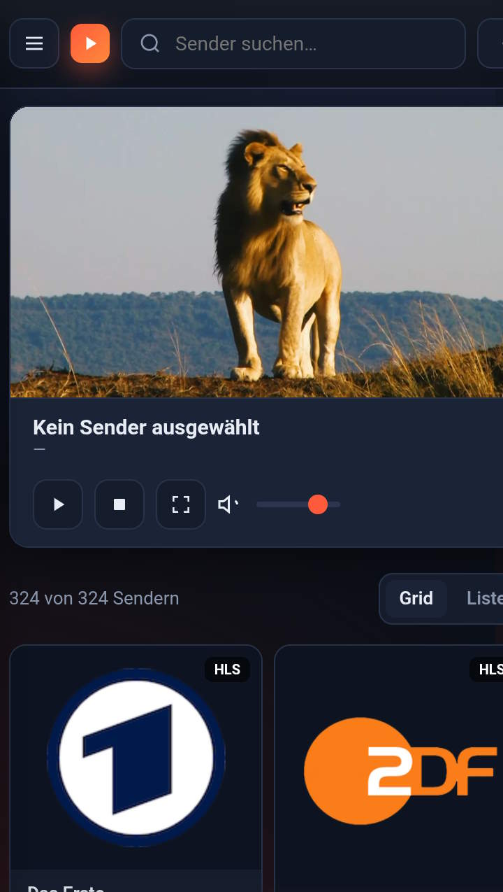

# M3U-Player

<p align="center">
    
</p>

Ein M3U-Playlist-Abspielprogramm das online als SPA funktioniert.

---

## Beschreibung ##

- Diese Single-Page-Webanwendung (SPA) stellt online einen Web-Player zur Verfügung, der M3U-Playlisten abspielt.
- Die Playlist kann entweder online per URL oder lokal per Dateiupload bereitgestellt werden. (Oben rechts mit dem ➕-Schalter)
- "tvg"-Gruppen werden angezeigt, und können angewählt werden. (Oben links mit dem  ☰-Schalter)
- Senderlogos werden dargestellt.
- Die Senderliste kann als Raster oder Liste dargestellt werden.
- "tvg"-Tags werden angezeigt.

---

## Player online nutzen ##

Der Player kann online unter folgender URL genutzt werden:

https://kling0ne.github.io/M3U-Player/

Hier befindet sich eine Beispiel-Playlist:

```
https://tinyurl.com/klingtv
```

---

## Screenshot ##

### Desktop ###


### Mobil ###

<p align="center">
    
</p>

---

## Features ##

### 1️⃣ Streaming von Sendern ###

- Live-TV und -Radio über M3U-Playlists streamen
- Zuletzt gespielte Sender ansehen
- Sender aus der Liste auswählen

### 2️⃣ Playlist-Ladungsmethoden ###

Drei verschiedene Möglichkeiten, um Inhalte zu laden:

- Option A - Playlist per URL laden:

Eine M3U-Playlist-URL eingeben  
Wichtig: Die URL muss CORS-Anfragen erlauben (Access-Control-Allow-Origin)

- Option B - Lokale Datei auswählen:

Eine lokale .m3u oder .m3u8-Datei hochladen

- Option C - M3U-Inhalt manuell einfügen:

M3U-Inhalt direkt im Textfeld einfügen oder kopieren

### 3️⃣ Ansichtsoptionen ###

- Wechsel zwischen Listen- und Grid-Ansicht (Netzwerkanzeige)
- Senderliste durchsuchen und auswählen
- 
### 4️⃣ Unterstützte Formate ###

- M3U-Playlists (.m3u, .m3u8)
- HTTP/HTTPS Streams

### 📝 Hinweis zur Nutzung: ###

- Keine Registrierung oder Anmeldung erforderlich
- Open-Source-Anwendung (auf GitHub gehostet)
- Funktioniert im Browser ohne Installation

---

## QR-Code ##

<p align="center">
    
</p>
